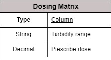
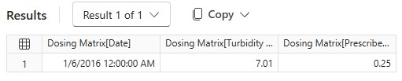

# Changing Ranges Over Period of Time

All files can be found in `Data Sources` folder


## Background of the tables
I use **Dosing Matrix** as sample data

There are two tables that should be merged: <br>
1. **Dosing Matrix:** <br>



2. **Turbidity Reading:** <br>


Prescribed dose in **Dosing Matrix** must be placed in the same column in **Turbidity Reading** based on the `turbidity reading column `matching with `turbidity range column.`


## Problem

**Dosing Matrix** is changing every 4 to 6 days depending on the given period. <br>
See 3 tables <br>


## Solution

### Step 1: Save all dosing matrix tables in CSV
1. Name each file based on the first date of its effectivity <br>
<br>
Sample table content of the first file: <br>
<br>

>**Explanation:** <br>
The metadata, file name will be transformed to date column later in the Power Query <br> 

<br>
2.  Save all the files in the same folder<br>
In this case, the folder name is Dosing Matrix. <br>

>**Explanation:** <br>
Import From Folder will be implemented if saved on local directory. 


### Step 2: Save the Turbidity Reading
The file should be named in this format: <br>
```
Results mm-yyyy.csv
```
>**Explanation:** <br>
Import From Folder will be implemented if saved on local directory. 


### Step 3: In Power BI Desktop, import each set of data as separate query
Import from folder: `Dosing Matrix` <br>
Import from folder: `Results`

The file final output for Dosing Matrix should be this:<br>
<br>

### Step 4: Add the Prescribed Dose in Results table
1. In table view, navigate to `Results `table
2. Add calculated column
3. Insert this formula

```DAX
Prescribed Dose = 
CALCULATE(
    MAX('Dosing Matrix'[Prescribed Dose]), -- THIS IS SCALAR VALUE FOR PRESCRIBE DOSE FOUND IN WHEN THE TABLE RETURNED TO TOP 1
    TOPN(1,
            FILTER(
                'Dosing Matrix',
                'Dosing Matrix'[Date] <= Results[Date] &&
                'Dosing Matrix'[Turbidity Range] <= Results[Turbidity Reading]
        ),
        'Dosing Matrix'[Date],DESC,
        'Dosing Matrix'[Turbidity Range],DESC
    )
)
```

>**EXPLANATION**<br>
If you check closely of the formula: <br>
This line of code is just an expression to grab the scalar value of Presribed Dose from Dosing Matrix table, you can use `SUM`, `MIN` or `AVERAGE`. It will still get the same return value.
```
MAX('Dosing Matrix'[Prescribed Dose])
```
>Check the modifier in DAX Query

```
EVALUATE
TOPN(1,
		FILTER(
            'Dosing Matrix',
            'Dosing Matrix'[Date] <= DATE(2016,1,10) &&
			'Dosing Matrix'[Turbidity Range] <= 12.36
	 ),
	 'Dosing Matrix'[Date],DESC,
	 'Dosing Matrix'[Turbidity Range],DESC
)
```
<br>
>The key here is to grab only the top 1 value for filtered table based on range and given turbidtiy reading <br>
<br>
>In Calculated Column this code is row context of `Date`:
```
DATE(2016,1,10)
```
>In Calculated Column this code is row context of `Turbidity Reading`:
```
12.36
```